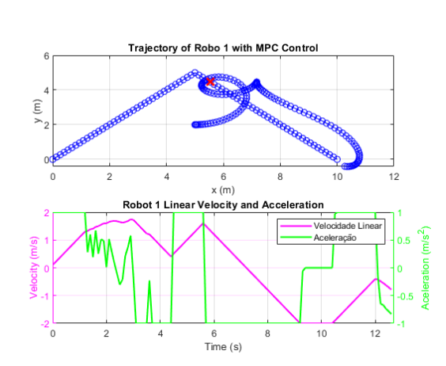
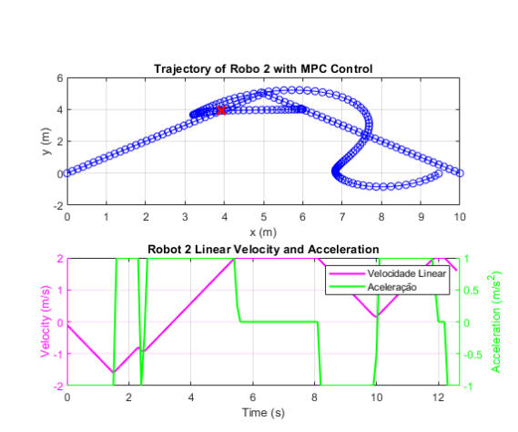
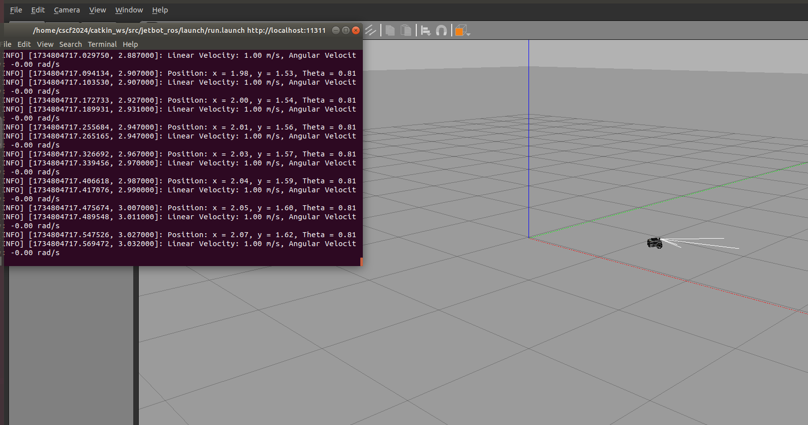

# JetBot MPC Controllers and ROS Implementation

## Project Overview

This project develops advanced **Model Predictive Control (MPC)** strategies for the JetBot robot, featuring two main parts:

### Part I – MATLAB MPC Controllers
Development of various MPC controllers in MATLAB for different navigation tasks:

1. **controllerSimple**  
   Drives a single JetBot from an initial position to a fixed target position.

2. **controllerTracking**  
   Makes a JetBot follow a predefined trajectory.

3. **controllerMovie**  
   Coordinates two robots to orbit a moving point from the right side, simulating a filming scenario.

4. **controllerCooperative**  
   Coordinates two robots, starting from arbitrary positions, to intercept and cover as much as possible of a third robot’s path.

Associated support scripts perform interception point calculations, reference selection, and waypoint interpolation. All controllers consider realistic constraints such as velocity and acceleration.

### Part II – ROS Implementation with CasADi
Implementation of the `controllerSimple` MPC in ROS using the CasADi optimization library. Features include:

- Integration with ROS for odometry and velocity command topics.  
- Simulation using Gazebo and RViz.  
- Real-time control to drive JetBot to a target position.

This ROS implementation builds upon and extends the base package [cybaer-nova/jetbot_ros](https://github.com/cybaer-nova/jetbot_ros).

Technical report available in the `docs/` folder.

---

## Project Structure

### MATLAB Controllers

- **controllerCooperative.m** – Cooperative MPC for two robots (interception/coverage).
- **controllerMovie.m** – MPC for dual robots orbiting a moving point.
- **controllerSimple.m** – MPC for driving JetBot to a target position.
- **controllerTracking.m** – MPC for trajectory tracking.
- **estimateIntersectionPoint.m** – Compute interception points.
- **ReferenceWithPoints.m** – Waypoint/reference point interpolation tools.
- **selectBestReferences.m** – Select best interception references.
- **Test_ControllerCooperative.m** – Test script for cooperative controller.
- **Test_ControllerMovie.m** – Test script for movie controller.
- **Test_ControllerSimple.m** – Test script for simple controller.
- **Test_ControllerTracking.m** – Test script for tracking controller.

### ROS Implementation

- **CMakeLists.txt** – ROS build configuration.
- **controller.py** – ROS node for controllerSimple (CasADi-based MPC).
- **controller4.py** – ROS node (prototype) for dual-controller logic.
- **controllerMovieSimCasadi.ipynb** – Jupyter simulation for movie controller.
- **controllerSimpleSIMcasadi.ipynb** – Jupyter simulation for simple controller.
- **README.txt** – Documentation for the ROS implementation.
- **run.launch** – Launch file for one JetBot + MPC.
- **runDualRobotController.launch** – Launch file for two simulated JetBots.


# JetBot MPC Controllers and ROS Implementation

## Project Overview
... descrição e explicações gerais ...

## Project Structure
... listagem dos ficheiros ...

## Cooperative Control Visualizations

  
*Trajectory and velocity profile of JetBot 1 during cooperative interception control.*

  
*Trajectory and velocity profile of JetBot 2 during cooperative interception control.*

  
*ROS simulation showing JetBot navigating in Gazebo using the CasADi-based MPC controller for cooperative tasks.*
---

## Requirements

### MATLAB Controllers
- MATLAB R2020 or later  
- Optimization Toolbox  
- YALMIP 

### ROS Implementation
- ROS Melodic/Noetic  
- Python 2.7 (tested with Python 2.7)  
- CasADi (v3.5.5 recommended)  
- numpy  
- Gazebo and RViz for simulation

---

## Installation and Usage

### MATLAB

1. Open MATLAB in the `matlab_controllers` directory.  
2. Run scripts like `Test_controllerSimple.m`, `Test_controllerTracking.m`, etc., to simulate each controller.  
3. Review simulation data and plots saved in the `simulation_results` folder.

### ROS

1. Install dependencies:
    ```
    pip2 install numpy casadi==3.5.5
    sudo apt-get install ros-melodic-tf
    ```

2. Copy `controller.py` (and optionally `controller4.py`) into the `scripts/` folder of your ROS workspace.

3. Replace the existing `CMakeLists.txt` and launch files (`run.launch`, `runDualRobotController.launch`) with those provided.

4. Launch single JetBot controller simulation:
    ```
    roslaunch jetbot_ros run.launch sim:=true
    ```

5. For multi-robot prototype launch:
    ```
    roslaunch jetbot_ros runDualRobotController.launch sim:=true
    ```

6. Use the provided Jupyter notebooks (`controllerSimpleSIMcasadi.ipynb`, `controllerMovieSimCasadi.ipynb`) to simulate and visualize the controllers outside ROS.

---

## Demonstration Video

Watch a demo of the ROS MPC trajectory controller in action:  
[YouTube: ROS Implementation of CasADi-Based MPC for JetBot Trajectory Control](https://youtu.be/jXjZQ6yIi38)

---

## Notes

- This project extends the JetBot base ROS package [`cybaer-nova/jetbot_ros`](https://github.com/cybaer-nova/jetbot_ros); the robot platform itself is not created from scratch.  
- Tested primarily with ROS Melodic, Python 2.7, and CasADi 3.5.5.  
- The `controllerMovie` ROS implementation is a prototype and not fully complete yet.

---

## License

This project is licensed under the MIT License.

---

## Authors and Acknowledgments

**Authors:** David Furtado, João Cardoso, Rodrigo Veríssimo  
**Supervision:** Prof. Daniel Silvestre, FCT NOVA  
**Base ROS package:** [cybaer-nova/jetbot_ros](https://github.com/cybaer-nova/jetbot_ros)

---


